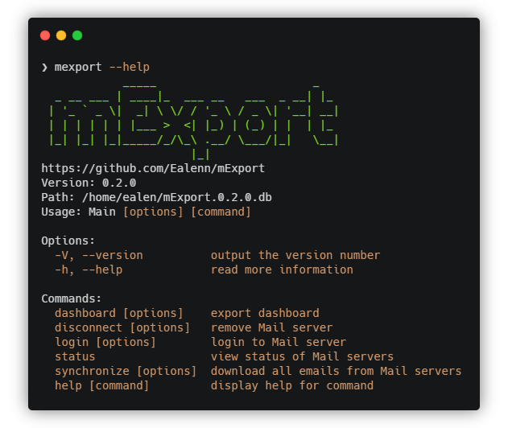

# mExport

[](https://codecov.io/gh/Ealenn/mExport)
[](https://github.com/Ealenn/mExport/stargazers)
[](https://github.com/Ealenn/mExport/issues)




> [GitHub](https://github.com/Ealenn/mExport) - [NPM](https://www.npmjs.com/package/mexport) - [DockerHub](https://hub.docker.com/r/ealen/mexport)

mExport is a command line interface (CLI) for processing and sorting emails.

- Display precise statistics on your emails 
- Easily unsubscribe from mailing lists

## Installation


Available for **Windows**, **MacOs** and **Linux** with **NodeJS** 
``` bash
npm i -g mexport@VERSION
```
[See available version](https://www.npmjs.com/package/mexport?activeTab=versions)

---

Or with **Docker** *(linux/amd64, linux/arm/v6, linux/arm/v7)*
``` bash
docker run --rm -v ${PWD}/mexport:/data ealen/mexport:VERSION --help
```
[See available version](https://hub.docker.com/r/ealen/mexport/tags)

You can also create an alias
``` bash
alias mexport='docker run --rm -v /tmp/mexport:/data ealen/mexport:latest'
```
---

## Getting Started

### Login to Server

``` bash
# With Interactive Mode
mexport login

# Without Interactive Mode
mexport login \
  -u, --user [user] \
  -p, --password [password] \
  -s, --server [server] \
  -i, --port [port] \
  --secure
```

## Development

``` bash
node ./dist/Main.js [command]
```

- `build`: Build project
- `build:watch` : Hot-Reload build

- `test`: Run tests with code coverage
- `local`: Install mexport with local project
- `refresh`: Refresh npm packages

- `docker:run`: Run mexport **dev** tag container with interactive flag
- `docker:build`: Build mexport Docker Image with **dev** tag